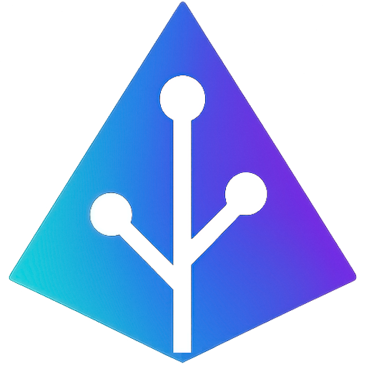

<div align="center">
  
  <h1>Marky</h1>
  <p><strong>AI-Powered Mindmap Creator</strong></p>
  <p>A modern, intuitive mindmap creation and editing application that transforms your ideas into beautiful visual mindmaps.</p>
  
  [](https://nextjs.org/)
  [](https://www.typescriptlang.org/)
  [](https://tailwindcss.com/)
  [](https://ui.shadcn.com/)
</div>

## ✨ Features

### 🎯 Core Functionality
- **🧠 AI-Powered Creation** - Generate mindmaps from text using advanced AI
- **✏️ Rich Markdown Editor** - Create and edit content with syntax highlighting
- **🎨 Interactive Visualizations** - Beautiful mindmap rendering with markmap.js
- **📱 Fully Responsive** - Seamless experience across all devices
- **🌙 Dark/Light Mode** - Beautiful themes with system preference detection

### 💾 Data Management
- **📁 File Import/Export** - Support for `.md`, `.markdown`, `.html`, and `.htm` files
- **💾 Local Storage** - Automatic saving and restoration of your work
- **🔄 Auto-save** - Never lose your progress with intelligent auto-saving
- **📤 HTML Export** - Export mindmaps as standalone HTML files

### 🎨 User Experience
- **⚡ Real-time Preview** - See your mindmap update instantly as you type
- **🎯 Smart Auto-fit** - Automatic window sizing for optimal viewing
- **📚 Learning Center** - Built-in tutorials and markdown guides
- **🔍 Error Handling** - Graceful error boundaries and user-friendly messages
- **♿ Accessibility** - WCAG compliant with keyboard navigation support

## 🛠️ Tech Stack

### Frontend
- **⚡ Next.js 15** - React framework with App Router
- **🎨 shadcn/ui** - Modern, accessible UI components
- **💅 Tailwind CSS** - Utility-first CSS framework
- **📘 TypeScript** - Type-safe JavaScript development

### Libraries & Tools
- **🗺️ markmap** - Interactive mindmap visualization
- **✏️ Lexical** - Extensible rich text editor
- **🎯 Lucide React** - Beautiful icon library
- **🤖 Custom AI Service** - Intelligent content generation
- **📦 React Error Boundary** - Graceful error handling

### Development
- **🔧 ESLint** - Code linting and formatting
- **📱 Responsive Design** - Mobile-first approach
- **♿ Accessibility** - WCAG 2.1 compliance
- **🚀 Performance** - Optimized for speed and efficiency

## 🚀 Getting Started

### Prerequisites
- Node.js 18+ 
- npm or yarn package manager

### Installation

1. **Clone the repository**:
   ```bash
   git clone https://github.com/your-username/marky-app.git
   cd marky-app
   ```

2. **Install dependencies**:
   ```bash
   npm install
   # or
   yarn install
   ```

3. **Run the development server**:
   ```bash
   npm run dev
   # or
   yarn dev
   ```

4. **Open your browser**:
   Navigate to [http://localhost:3000](http://localhost:3000)

### Environment Setup (Optional)
Create a `.env.local` file for custom configuration:
```env
NEXT_PUBLIC_GITHUB_URL=https://github.com/your-username
NEXT_PUBLIC_LINKEDIN_URL=https://linkedin.com/in/your-profile
```

## 📁 Project Structure

```
marky-app/
├── public/                    # Static assets
│   └── marky-logo.png        # Project logo
├── src/
│   ├── app/                  # Next.js App Router
│   │   ├── layout.tsx        # Root layout with SEO
│   │   ├── page.tsx          # Main mindmap editor page
│   │   ├── learn/            # Learning center
│   │   ├── globals.css       # Global styles & themes
│   │   ├── sitemap.ts        # SEO sitemap
│   │   ├── robots.ts         # SEO robots.txt
│   │   └── not-found.tsx     # Custom 404 page
│   ├── components/           # React components
│   │   ├── editor/          # Rich text editor
│   │   ├── blocks/          # Editor blocks & plugins
│   │   ├── ui/              # shadcn/ui components
│   │   ├── markmap-viewer.tsx
│   │   ├── main-navigation.tsx
│   │   ├── theme-provider.tsx
│   │   └── ...              # Other components
│   ├── lib/                 # Utilities & services
│   │   ├── markmap.ts       # Markmap core utilities
│   │   ├── markmap-utils.ts # HTML/MD parsing & conversion
│   │   ├── html-export.ts   # Export functionality
│   │   ├── ai-service.ts    # AI integration
│   │   └── utils.ts         # General utilities
│   └── hooks/               # Custom React hooks
├── .env.local               # Environment variables
├── components.json          # shadcn/ui configuration
├── tailwind.config.js       # Tailwind CSS config
└── package.json            # Dependencies & scripts
```

## 📜 Available Scripts

| Command | Description |
|---------|-------------|
| `npm run dev` | Start development server on [localhost:3000](http://localhost:3000) |
| `npm run build` | Build optimized production bundle |
| `npm run start` | Start production server |
| `npm run lint` | Run ESLint for code quality checks |

## 🎯 Usage

### Creating Your First Mindmap
1. **Start with the starter template** - The app provides a helpful starter mindmap
2. **Edit the markdown** - Use the left panel to modify your content
3. **Watch it update** - See your changes reflected in real-time on the right
4. **Export when ready** - Save as HTML or import existing files

### Supported File Formats
- **Import**: `.md`, `.markdown`, `.html`, `.htm`
- **Export**: `.html` (standalone files)

### Markdown Features
- **Headers** (`#`, `##`, `###`) - Create mindmap nodes
- **Lists** (`-`, `*`, `+`) - Add sub-nodes
- **Code blocks** - Syntax highlighted code
- **Tables** - Structured data visualization
- **Links** - Interactive connections
- **Emojis** - Visual enhancement

## 🤝 Contributing

We welcome contributions! Please see our [Contributing Guidelines](CONTRIBUTING.md) for details.

### Development Workflow
1. Fork the repository
2. Create a feature branch (`git checkout -b feature/amazing-feature`)
3. Commit your changes (`git commit -m 'Add amazing feature'`)
4. Push to the branch (`git push origin feature/amazing-feature`)
5. Open a Pull Request

## 📄 License

This project is licensed under the MIT License - see the [LICENSE](LICENSE) file for details.

## 🙏 Acknowledgments

- [markmap](https://github.com/gera2ld/markmap) - The amazing mindmap visualization library
- [shadcn/ui](https://ui.shadcn.com/) - Beautiful, accessible UI components
- [Next.js](https://nextjs.org/) - The React framework for production
- [Tailwind CSS](https://tailwindcss.com/) - Utility-first CSS framework

## 📞 Support

- **Issues**: [GitHub Issues](https://github.com/your-username/marky-app/issues)
- **Discussions**: [GitHub Discussions](https://github.com/your-username/marky-app/discussions)
- **Email**: your-email@example.com

---

<div align="center">
  <p>Made with ❤️ by <strong>Jimmy</strong></p>
  <p>
    <a href="https://github.com/your-username">GitHub</a> •
    <a href="https://linkedin.com/in/your-profile">LinkedIn</a>
  </p>
</div>